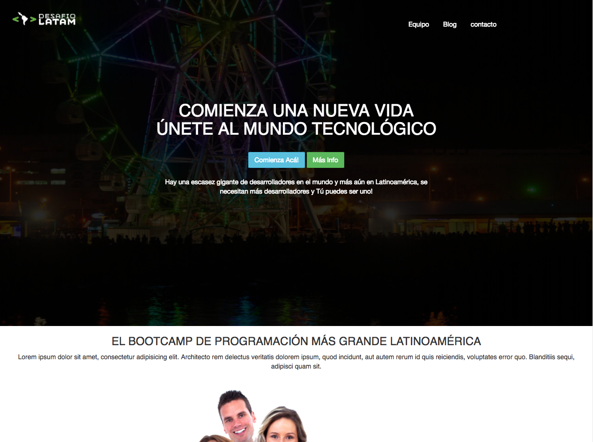

<section>
<a href="http://desafiolatam.com"></a>

# Actividad presencial 21

**Link Repositorio**

## De página estática a tema de WordPress



En esta actividad vamos a refactorizar el landing page de la experiencia presencial 7, pasándola de una página estática con bootstrap y Jquery a un tema funcional de WordPress que incluya estas características.

La idea es que al final de esta actividad puedas transformar cualquier página estática en un tema de WordPress.
 
### Antes de empezar

- Para poder realizar esta actividad debes haber realizado los cursos previos junto con haber visto los videos online correspondientes a la experiencia online 10.
- Guarda los cambios y súbelos a tu repositorio de github.
- Luego de pusheados los últimos cambios, sube el link de Github en el desafío de la sección correspondiente en la plataforma.

**Comencemos**

### Instrucciones:

- Descarga WordPress desde <https://www.wordpress.org/>.

- Instala en Local WordPress.

- Crea una carpeta para el tema dentro de la instalación WordPress.

- abre la carpeta que creaste con tu editor de texto favorito.

- Crea los archivos `style.css`, `index.php`, `header.php`, `footer.php`, y `functions.php`.

- Crea también las carpetas para alojar los `CSS`, `JS`, e imágenes.

- Traspasa los `CSS`, `JS`, e imágenes del landing page a sus correspondientes carpetas dentro del tema que estás creando.

- Registra todos los estilos y scripts dentro de `functions.php`.

- Agrega en `header.php` el DOCTYPE, los metas, el título, y la barra de navegación del HTML del landing page.

- Agrega en `footer.php` el footer del landing page. 

- Agrega en `index.php` todas las secciones que creaste en el HTML, exceptuando al footer.
> Hint: Para cambiar la dirección de las imágenes, usa el siguiente código como referencia:
>
	```php 
		/img/lorem-ipsum.png "

## ¿Tienes tiempo todavía?	

-	Crea las páginas estáticas `inicio`, `equipo`, `blog` y `contacto` dentro de la sección páginas.
- 	Crea 3 entradas para el blog, que contengan contenido, categorías, etiquetas, e imagen destacada.
- 	Configura la página de inicio y blog para que sean la página principal y la de entradas respectivamente.
- 	Crea un `front-page.php` y agrega dentro de este archivo un loop básico de wordpress que contenga en su interior una función llamada `the_content`.

> Hint: Para más información ir a [https://codex.wordpress.org/The_Loop_in_Action](https://codex.wordpress.org/The_Loop_in_Action)

-	Pega el contenido HTML que copiaste en `index.php` dentro del administrador de contenido, en la página de inicio.
